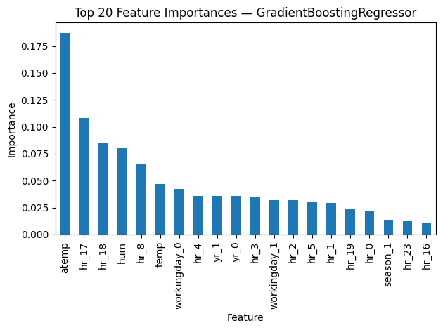

# DA5401: Assignment 8 — Ensemble Regression on Bike Sharing Data

## Student Details

* **Name:** Chirag
* **Roll Number:** DA25M008

---

## Overview

This assignment applies and compares a range of **ensemble regression algorithms** on the **Bike Sharing dataset** from the Capital Bikeshare system, Washington D.C. (2011–2012).
The goal is to predict **hourly bike rental demand (`cnt`)** using environmental and temporal features, and to analyze the performance of ensemble methods in reducing bias and variance compared to single-model baselines.

---

## Methodology

1. **Dataset:**

   * File: `hour.csv`
   * Records: 17,379 hourly samples (2011–2012)
   * Features:

     * Temporal: `season`, `yr`, `mnth`, `hr`, `weekday`, `holiday`, `workingday`
     * Weather: `weathersit`, `temp`, `atemp`, `hum`, `windspeed`
   * Target: `cnt` — total number of rented bikes per hour
   * Dropped Columns: `instant`, `dteday`, `casual`, `registered`

2. **Preprocessing:**

   * One-hot encoding for categorical variables
   * Standard scaling for numerical variables
   * Time-aware split: first 80% for training, last 20% for testing (to avoid leakage)

3. **Models Evaluated:**

   * Decision Tree Regressor (baseline)
   * Linear Regression (baseline)
   * Bagging Regressor (Decision Tree base)
   * Gradient Boosting Regressor
   * Stacking Regressor (KNN + Bagging + Gradient Boosting → Ridge Regression)

4. **Evaluation Metric:**

   * **Root Mean Squared Error (RMSE)**

---

## Results Summary

| Rank | Model                                  |  RMSE  |
| :--: | :------------------------------------- | :----: |
|   1  | Stacking (KNN + Bagging + GBR → Ridge) | 115.44 |
|   2  | Gradient Boosting Regressor            | 123.19 |
|   3  | Baseline (Decision Tree / Linear)      | 133.83 |
|   4  | Bagging (DT@6, n=100)                  | 155.32 |

---

## Visualizations

### Feature Importance Plot

---

## Insights

* Stacking achieved the lowest RMSE, improving by approximately 14% over the best single-model baseline.
* Gradient Boosting performed well by progressively reducing bias.
* Bagging stabilized variance but did not reduce bias as effectively.
* Temporal variables such as **hour of day**, and environmental features like **temperature** and **weather condition**, had the highest predictive influence.
* Ensemble models demonstrated the advantage of combining diverse learners to balance bias and variance in regression tasks.

---

## Conclusion

This assignment demonstrates how **ensemble regression techniques** improve predictive performance over single estimators in a real-world, time-dependent dataset.
**Stacking** proved to be the best-performing method, combining multiple weak learners to achieve the most balanced and accurate predictions.
The results highlight the practical utility of ensemble learning for **demand forecasting** and **smart city mobility planning**.

---
